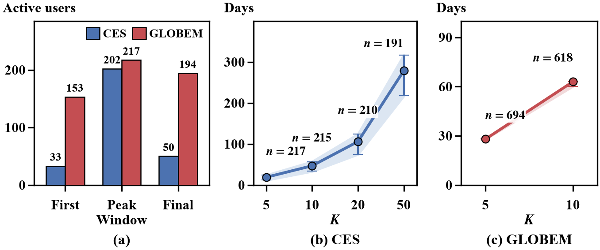
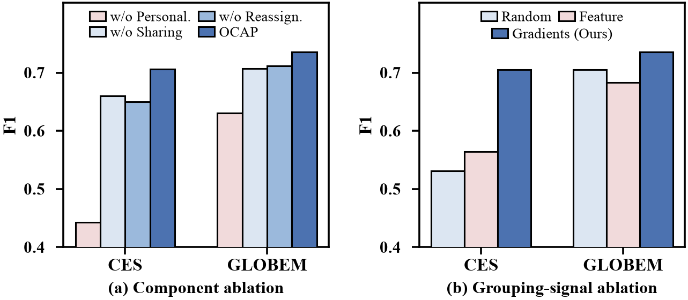
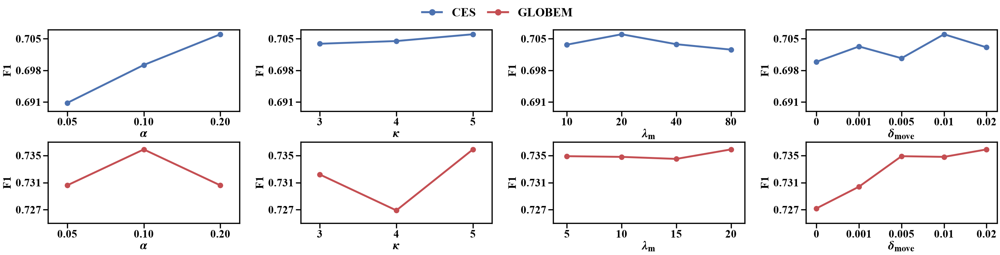
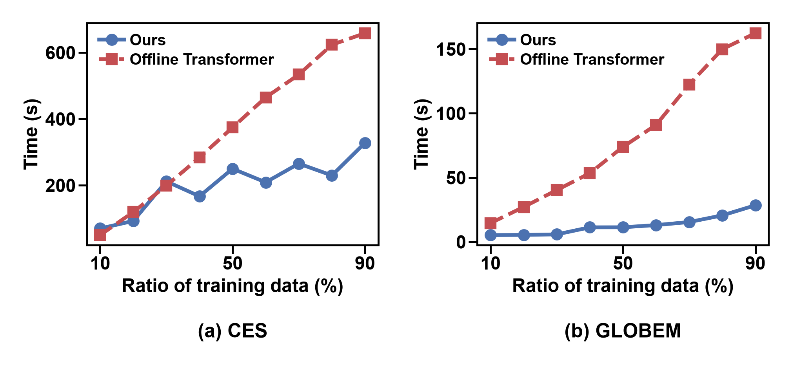

# SG-Share / ECAP Reproduction Code

This repository contains the executable SG-Share implementation and the
experiment runners corresponding to the current manuscript artifact
[paper/OCAP.pdf](paper/OCAP.pdf). It covers data preparation, full-stream classification,
new-user first-K evaluation, offline and online baselines, component and
grouping-signal ablations, parameter sensitivity, and efficiency profiling.

The historical experiment repository was not recovered byte-for-byte.
`sgshare/` is a clean-room reconstruction whose numerical runs are identified
by the resolved configuration and processed-stream SHA-256. Read
[Provenance](docs/PROVENANCE.md),
[Reproduction status](docs/REPRODUCTION_STATUS.md), and
[SOTA fidelity](docs/SOTA_FAITHFULNESS_AUDIT.md) before interpreting results.
The retained-versus-excluded file audit is documented in
[Repository audit](docs/REPOSITORY_AUDIT.md).

## 1. Paper and code relationship

The bundled 10-page PDF, result-table sources, and result figures were exported
from paper commit
`297f60f3b87fba18ac7ae4f48a83dd79c17abc68`. The executable code baseline is
`c81444cc75c728543fcdfeb39f8f6b318b01613e`, which packages the settings used by
the SeetaCloud experiments recorded under the `code-91f7d5b` runtime snapshot.
The paper artifact is the reporting reference. Each reported table or figure
is placed beside the corresponding experiment in Section 5. Tables are
transcribed into a GitHub-readable layout, while figures use the exact paper
assets. Known paper/code differences are listed in Section 8.

Version-matched paper assets:

- [complete paper PDF](paper/OCAP.pdf);
- [full-stream table source](paper/tables/main_results.tex);
- [new-user first-K table source](paper/tables/cold_start_results.tex);
- [artifact hashes](paper/MANIFEST.sha256);
- [paper/code relationship and provenance](paper/README.md).

The current manuscript uses two selected SG-Share configurations per dataset:

- `classification_tuned` for the full-stream main table, ablations, and
  sensitivity analysis;
- `cold_safe` for the new-user first-K table.

The executable registry is [sgshare/presets.py](sgshare/presets.py).

| Dataset | Preset | Route-gradient EMA alpha | Stored EMA decay | Admission observations | `k_min` | Mature reassignment | Verified split |
|---|---|---:|---:|---:|---:|---|---:|
| CES | `classification_tuned` | 0.20 | 0.80 | 20 | 5 | `20 / 0.01` | off |
| CES | `cold_safe` | 0.05 | 0.95 | 20 | 3 | `20 / 0.01` | off |
| GLOBEM | `classification_tuned` | 0.10 | 0.90 | 2 | 5 | `20 / 0.01` | off |
| GLOBEM | `cold_safe` | 0.12 | 0.88 | 2 | 4 | `20 / 0.01` | off |

`Mature reassignment` is shown as
`mature_min_observations / mature_loss_margin`.

The remaining dataset-specific settings come from
[configs/ces.yaml](configs/ces.yaml) and
[configs/globem.yaml](configs/globem.yaml):

| Setting | CES | GLOBEM |
|---|---:|---:|
| Processed events / users / inputs | 35,289 / 218 / 37 | 8,225 / 704 / 130 |
| TinyTFT hidden dimension / depth / heads | 32 / 2 / 4 | 16 / 1 / 2 |
| LoRA rank / alpha | 4 / 8 | 4 / 8 |
| Backbone learning rate | 0.0002 | 0.0003 |
| Group-adapter learning rate | 0.007 | 0.005 |
| Focal gamma / alpha / positive weight | 2.0 / 0.75 / 5.0 | 2.0 / 0.75 / 5.0 |
| Backbone warm-up events | 300 | 120 |
| Periodic regroup interval | 100 | 120 |
| Initial grouping minimum / fallback observations | 5 / 1 | 5 / 1 |
| Smoothing window | 5 | 3 |
| Online threshold history / refresh interval | 1000 / 100 | 500 / 50 |
| User positive-rate threshold correction | off | on, alpha 0.09 |
| First-K values | 5, 10, 20, 50 | 5, 10 |

The preset registry overrides the YAML values for route-gradient EMA,
admission observations, `k_min`, verified split, and mature reassignment.
Every result directory contains the fully resolved `config.yaml`; it is the
configuration source of truth for that run.

## 2. Implemented online path

The core implementation is:

- [sgshare/model.py](sgshare/model.py): TinyTFT-style backbone, rank-4 LoRA
  adapters, and weighted focal loss;
- [sgshare/learner.py](sgshare/learner.py): prequential prediction/update,
  temporary and group adapters, route-gradient signatures, regrouping,
  calibration, and mature reassignment;
- [sgshare/grouping.py](sgshare/grouping.py): cosine agglomeration and
  feature/random grouping controls;
- [sgshare/config.py](sgshare/config.py): complete configuration schema;
- [sgshare/presets.py](sgshare/presets.py): manuscript-selected points.

At event `t`, the learner predicts before observing `y_t`, records the
prediction, and only then performs the online update.

The default manuscript-aligned group path is:

1. Each unassigned user uses a temporary rank-4 LoRA adapter.
2. The classification-loss gradient on `route_w` updates the user's EMA
   signature.
3. At a grouping boundary, eligible users start as singleton groups.
4. The two group centroids with the largest cosine similarity are merged.
5. Merging stops when `k_min` groups remain or the best similarity is negative.
6. Users without a valid assignment keep their temporary adapter; assigned
   users use a reusable group adapter.
7. Mature users may be reassigned when another current group reduces recent
   loss by more than `0.01` after at least 20 observations.

`k_min` is a lower target on the number of agglomerative groups. It is not a
minimum group size and not an observation threshold.

The current selected configuration uses
`group_adapter_mode=standalone`. Once grouped, a user's temporary personal
adapter is not updated in parallel. The optional `user_mean` and
`shadow_personal` modes are separate experiments and must not be mixed with
the results below.

## 3. Data contract

Participant-level processed data are not distributed through Git.



CES expands and later contracts, while GLOBEM contains different participants
across years. In both datasets, users enter and leave the stream
asynchronously. Accumulating more user-specific evidence takes substantially
longer and fewer users reach larger K values, motivating continual adaptation
and collaborative support before sufficient personal evidence is available.

### CES

- Official source: College Experience Dataset, Kaggle release v5.
- Required file:
  `data/processed/ces_historical_usernorm.csv`
- Expected SHA-256:
  `771a8973ac58e1b50a071e0e55ed681a022b7f283cc7f19c631e365720745eb5`

Authorized users can build it with:

```bash
python scripts/prepare_ces_historical.py \
  --source-root data/raw/ces/official_v5 \
  --output-csv data/processed/ces_historical_usernorm.csv
```

### GLOBEM

- Official source: GLOBEM v1.1 on PhysioNet.
- Required file: `data/processed/globem_full.csv`
- Expected SHA-256:
  `d7ead91d72b647d3e881ae43c8bd0837906935720969081a59c1c6c996caeacc`

GLOBEM requires credentialed PhysioNet access and acceptance of its data-use
agreement. Follow [the GLOBEM pipeline](docs/GLOBEM_PIPELINE.md); do not
redistribute the raw or derived participant-level stream.

Validate both processed streams before running experiments:

```bash
python scripts/validate_stream.py \
  data/processed/ces_historical_usernorm.csv
python scripts/validate_stream.py \
  data/processed/globem_full.csv
```

## 4. Environment

Use Python 3.10 or newer and a CUDA-capable PyTorch installation:

```bash
python -m venv .venv
source .venv/bin/activate
python -m pip install -U pip
python -m pip install -e .
python -m unittest discover -s tests -v
```

The selected result artifacts use seed 42 unless a table explicitly reports
multiple seeds. They were produced on SeetaCloud RTX instances from immutable
runtime snapshots; short CPU-only diagnostics are identified separately in
their logs. Do not label these results as V100 runs. The exact device and
resolved configuration from each result directory are the source of truth.

The PBS/V100 files under `scripts/` are optional launchers for another cluster
and were not used to validate commit `c81444c`. See
[scripts/README.md](scripts/README.md) for that boundary.

Set common paths:

```bash
CES=data/processed/ces_historical_usernorm.csv
GLOBEM=data/processed/globem_full.csv
OUT=results/manuscript
mkdir -p "$OUT"
```

## 5. Complete experiment matrix

### 5.1 Full-stream SG-Share classification

Runner: [process/run_sg_share_named_preset.py](process/run_sg_share_named_preset.py)

```bash
python process/run_sg_share_named_preset.py \
  --dataset ces --preset classification_tuned \
  --data "$CES" --output "$OUT/main_classification" \
  --seeds 42 --device cuda --torch-threads 8

python process/run_sg_share_named_preset.py \
  --dataset globem --preset classification_tuned \
  --data "$GLOBEM" --output "$OUT/main_classification" \
  --seeds 42 --device cuda --torch-threads 8
```

Table 2 compares offline ML, offline DL, global online, per-user online, and
OCAP. F1 and Recall use the mental-health-risk class, Accuracy uses all
observations, and AUC measures discrimination. **Bold** and <u>underline</u>
mark the best and second-best values for each dataset and metric.

#### CES

| Setting | Method | Recall | Accuracy | AUC | F1 |
|---|---|---:|---:|---:|---:|
| Offline ML | XGB | 0.4500 | 0.5370 | 0.5240 | 0.4450 |
| Offline ML | SVM | 0.3130 | 0.5702 | 0.5317 | 0.3750 |
| Offline ML | LR | 0.4960 | 0.5297 | 0.5247 | 0.4650 |
| Offline ML | RF | 0.3070 | 0.5677 | 0.5287 | 0.3690 |
| Offline ML | LGBM | 0.4080 | 0.5377 | 0.5182 | 0.4210 |
| Offline ML | DT | 0.4650 | 0.5182 | 0.5104 | 0.4430 |
| Offline DL | LSTM | 0.5790 | 0.5724 | 0.5753 | 0.4300 |
| Offline DL | Transformer | 0.4890 | 0.5700 | 0.5450 | 0.3870 |
| Offline DL | TCN | 0.3570 | 0.5825 | 0.5132 | 0.3220 |
| Offline DL | MLP | 0.3860 | 0.5646 | 0.5099 | 0.3300 |
| Online (Global) | HBP/ODL | 0.8599 | 0.4254 | 0.5561 | 0.4602 |
| Online (Global) | KOIL | **0.9125** | 0.3563 | 0.5236 | 0.4468 |
| Online (Global) | OLFL | 0.8784 | 0.3966 | 0.5416 | 0.4534 |
| Online (Global) | OLI²DS | 0.8720 | 0.4168 | 0.5538 | 0.4600 |
| Online (Global) | OLIFL | <u>0.8943</u> | 0.3844 | 0.5378 | 0.4528 |
| Online (Per-user) | HBP/ODL | 0.4955 | 0.7245 | 0.7457 | 0.5061 |
| Online (Per-user) | KOIL | 0.4838 | 0.7575 | 0.7294 | 0.5320 |
| Online (Per-user) | OLFL | 0.6329 | 0.7543 | 0.8408 | 0.5947 |
| Online (Per-user) | OLI²DS | 0.7436 | 0.7358 | 0.8104 | 0.6159 |
| Online (Per-user) | OLIFL | 0.6812 | <u>0.7945</u> | <u>0.8650</u> | <u>0.6538</u> |
| Ours | **OCAP** | 0.7543 | **0.8203** | **0.8709** | **0.7060** |

#### GLOBEM

| Setting | Method | Recall | Accuracy | AUC | F1 |
|---|---|---:|---:|---:|---:|
| Offline ML | XGB | 0.5150 | 0.5456 | 0.5436 | 0.5120 |
| Offline ML | SVM | 0.3630 | 0.5503 | 0.5374 | 0.4280 |
| Offline ML | LR | 0.5990 | 0.5503 | 0.5535 | 0.5520 |
| Offline ML | RF | 0.5030 | 0.5398 | 0.5373 | 0.5030 |
| Offline ML | LGBM | 0.5280 | 0.5450 | 0.5439 | 0.5180 |
| Offline ML | DT | 0.5500 | 0.5276 | 0.5292 | 0.5190 |
| Offline DL | LSTM | 0.2630 | 0.5445 | 0.5251 | 0.3480 |
| Offline DL | Transformer | 0.6710 | 0.5404 | 0.5494 | 0.5750 |
| Offline DL | TCN | 0.4410 | 0.4927 | 0.4892 | 0.4460 |
| Offline DL | MLP | 0.3810 | 0.4939 | 0.4862 | 0.4110 |
| Online (Global) | HBP/ODL | <u>0.9777</u> | 0.4707 | 0.5064 | 0.6306 |
| Online (Global) | KOIL | **0.9813** | 0.4654 | 0.5017 | 0.6292 |
| Online (Global) | OLFL | 0.9753 | 0.4715 | 0.5070 | 0.6304 |
| Online (Global) | OLI²DS | 0.9658 | 0.4744 | 0.5090 | 0.6294 |
| Online (Global) | OLIFL | 0.9669 | 0.4706 | 0.5056 | 0.6280 |
| Online (Per-user) | HBP/ODL | 0.5551 | 0.5467 | 0.5685 | 0.5310 |
| Online (Per-user) | KOIL | 0.5043 | 0.6900 | 0.6306 | 0.6006 |
| Online (Per-user) | OLFL | 0.7619 | **0.7419** | **0.8301** | <u>0.7318</u> |
| Online (Per-user) | OLI²DS | 0.7703 | 0.7357 | 0.8011 | 0.7293 |
| Online (Per-user) | OLIFL | 0.7469 | <u>0.7409</u> | <u>0.8175</u> | 0.7271 |
| Ours | **OCAP** | 0.8503 | 0.7179 | 0.7926 | **0.7359** |

Online methods consistently outperform offline models. Per-user online models
usually improve over their global counterparts, showing the need to represent
heterogeneous behavior-state relationships. OCAP achieves the best F1 on both
datasets; on CES it also obtains the best Accuracy and AUC, while on GLOBEM its
other metrics remain comparable to the strongest per-user baselines. The
global methods' high Recall should be interpreted with their low Accuracy and
F1, because broad positive predictions also produce many false positives.

The manuscript-facing result is transcribed above. Its
[LaTeX source](paper/tables/main_results.tex) and
[versioned CSV transcription](expected/manuscript_main_results.csv) preserve
the paper display exactly. Fresh rerun values belong in a separate result
directory and must not replace this paper snapshot.

### 5.2 New-user first-K evaluation

The paper's early-monitoring table uses `cold_safe`, not the
classification-tuned event file:

```bash
python process/run_sg_share_named_preset.py \
  --dataset ces --preset cold_safe \
  --data "$CES" --output "$OUT/cold_start" \
  --seeds 42 --device cuda --torch-threads 8

python process/run_sg_share_named_preset.py \
  --dataset globem --preset cold_safe \
  --data "$GLOBEM" --output "$OUT/cold_start" \
  --seeds 42 --device cuda --torch-threads 8
```

Table 3 evaluates every eligible user's first K predictions and then averages
the user-level mental-health-risk F1 and Recall. **Bold** and
<u>underline</u> mark the best and second-best values.

| Method | CES F1@5 | CES F1@10 | CES R@5 | CES R@10 | GLOBEM F1@5 | GLOBEM F1@10 | GLOBEM R@5 | GLOBEM R@10 |
|---|---:|---:|---:|---:|---:|---:|---:|---:|
| HBP/ODL | 0.1300 | 0.1409 | 0.1882 | 0.2178 | 0.2772 | 0.3129 | 0.3512 | 0.4009 |
| KOIL | 0.2060 | 0.1861 | 0.2277 | 0.2016 | 0.3490 | 0.3031 | 0.3622 | 0.2932 |
| OLFL | 0.2162 | 0.2100 | 0.2773 | 0.2811 | 0.3829 | 0.4252 | 0.4280 | 0.4538 |
| OLI²DS | 0.2322 | <u>0.2427</u> | 0.2888 | <u>0.3015</u> | <u>0.4060</u> | <u>0.4585</u> | <u>0.4334</u> | <u>0.4769</u> |
| OLIFL | <u>0.2328</u> | 0.2267 | <u>0.2930</u> | 0.2951 | 0.3911 | 0.4222 | 0.4241 | 0.4427 |
| **OCAP** | **0.2713** | **0.2632** | **0.3848** | **0.3932** | **0.4380** | **0.4697** | **0.5180** | **0.5445** |

OCAP outperforms every baseline in all reported low-evidence cases. Its margin
over the strongest baseline is consistently larger at K=5 than at K=10,
indicating that collaborative grouping is most valuable when isolated personal
adapters have very little evidence. Gradient-based grouping broadens the
evidence base, while reassignment limits interference from outdated sharing
relationships.

The manuscript-facing result is transcribed above. Its
[LaTeX source](paper/tables/cold_start_results.tex) and
[versioned CSV transcription](expected/manuscript_cold_start_results.csv)
preserve the paper display exactly. Each value is computed per eligible user
over that user's first K prequential predictions and then averaged across
users. These are positive-class F1 and Recall, not class-macro metrics and not
pooled event metrics.

[process/run_table3_experiments.py](process/run_table3_experiments.py) runs the
same first-K protocol jointly for HBP/ODL, KOIL, OLFL, OLI2DS, OLIFL, and
SG-Share:

```bash
python process/run_table3_experiments.py \
  --dataset ces --data "$CES" --output "$OUT/first_k/ces" \
  --methods hbp,koil,olfl,oli2ds,olifl,ecap \
  --seeds 42 --device cuda --torch-threads 8

python process/run_table3_experiments.py \
  --dataset globem --data "$GLOBEM" --output "$OUT/first_k/globem" \
  --methods hbp,koil,olfl,oli2ds,olifl,ecap \
  --seeds 42 --device cuda --torch-threads 8
```

### 5.3 Offline baselines

Runner:
[process/run_offline_table2_experiments.py](process/run_offline_table2_experiments.py)

The protocol is chronological 80% training and frozen 20% evaluation.

```bash
python process/run_offline_table2_experiments.py \
  --datasets ces,globem \
  --ces-data "$CES" --globem-data "$GLOBEM" \
  --output "$OUT/offline" \
  --methods lstm_attention,transformer,tcn,mlp,xgboost,svm,lr,random_forest,lightgbm,decision_tree \
  --seeds 42 --train-fraction 0.8 \
  --device cuda --epochs 50 --batch-size 128 \
  --learning-rate 0.001 --torch-threads 8
```

### 5.4 Online global and per-user baselines

Runner:
[process/run_online_sota_suite.py](process/run_online_sota_suite.py)

The main table reports both global and per-user scopes for HBP/ODL, KOIL,
OLFL, OLI2DS, and OLIFL. Online-SOTA classification uses each native learner
implementation. For the separately reported raw comparison, use fixed
probability threshold 0.5, no smoothing, and no threshold search:

```bash
python process/run_online_sota_suite.py \
  --datasets ces,globem \
  --methods hbp,koil,olfl,oli2ds,olifl \
  --scopes global,per_user --seeds 42 \
  --ces-data "$CES" --globem-data "$GLOBEM" \
  --output "$OUT/online_sota_raw05" \
  --no-scaling --raw-fixed-05
```

The SOTA classes are implemented in
[sgshare/online_sota.py](sgshare/online_sota.py). Their reproduction boundary
is documented in [Online SOTA reproduction](docs/ONLINE_SOTA_REPRODUCTION.md).
OLFL and OLIFL are compatibility implementations rather than certified
official numerical reproductions.

### 5.5 Component and grouping-signal ablations

Runner:
[process/run_manuscript_ablations.py](process/run_manuscript_ablations.py)

All variants start from `classification_tuned`. `full` is therefore the same
method/configuration as the SG-Share row in the full-stream main experiment.

Component variants:

| Variant | Exact change from `full` |
|---|---|
| `without_personalization` | `method=global_shared`; user bias, user threshold correction, and mature reassignment off |
| `without_grouping` | `method=per_user_adapter`; mature reassignment off |
| `without_reassignment` | periodic regroup and mature reassignment off after the initial grouping |
| `full` | no change |

Grouping-signal variants:

| Variant | Exact change from `full` |
|---|---|
| `feature_grouping` | replace route-gradient signatures with standardized behavior features |
| `random_grouping` | replace route-gradient grouping with seeded random assignment |
| `full` | route-gradient grouping |

```bash
for DATASET in ces globem; do
  if [ "$DATASET" = ces ]; then DATA="$CES"; else DATA="$GLOBEM"; fi
  python process/run_manuscript_ablations.py \
    --dataset "$DATASET" --data "$DATA" \
    --output "$OUT/ablations/$DATASET" \
    --variants full,without_personalization,without_grouping,without_reassignment,feature_grouping,random_grouping \
    --seeds 42 --device cuda --torch-threads 8
done
```

`summary.csv` contains both metric families:

- `f1_pos` and `recall_pos`: positive-risk-class metrics used by the current
  full-stream paper figure;
- `macro_f1` and `macro_recall`: equal-weight class-macro diagnostics;
- `first_k_user_macro_f1_pos` and
  `first_k_user_macro_recall_pos`: the Table-3 first-K convention;
- `first_k_user_macro_class_macro_f1` and
  `first_k_user_macro_class_macro_recall`: balanced first-K diagnostics.

Do not label the class-macro columns as F1(+) or Recall(+).



Removing personalization causes the largest degradation, especially on CES.
Removing group sharing also lowers F1 because each user must learn from limited
personal data alone, and disabling reassignment makes fixed groups less
suitable as user update directions evolve. Random and feature-based grouping
are inconsistent across datasets; gradient-based grouping achieves the highest
F1 on both because update directions directly describe how each user's adapter
needs to learn.

The reported values are transcribed in
[manuscript_ablation_results.csv](expected/manuscript_ablation_results.csv).

### 5.6 Route-gradient EMA alpha and minimum group count

Runner:
[process/run_sg_share_parameter_search.py](process/run_sg_share_parameter_search.py)

The figure varies one factor at a time from `classification_tuned`:

```bash
python process/run_sg_share_parameter_search.py \
  --dataset ces --data "$CES" --output "$OUT/sensitivity/ces_alpha_k" \
  --base-preset classification_tuned --device cuda \
  --alphas 0.05,0.10,0.20 --lambdas 20 --ks 3,4,5 \
  --gradient-modes raw --eligibility-modes legacy \
  --search-strategy one_factor --seed 42 --torch-threads 8

python process/run_sg_share_parameter_search.py \
  --dataset globem --data "$GLOBEM" --output "$OUT/sensitivity/globem_alpha_k" \
  --base-preset classification_tuned --device cuda \
  --alphas 0.05,0.10,0.20 --lambdas 2 --ks 3,4,5 \
  --gradient-modes raw --eligibility-modes legacy \
  --search-strategy one_factor --seed 42 --torch-threads 8
```

These runs produce the alpha and `k_min` panels in the complete sensitivity
figure shown after Section 5.7.

### 5.7 Mature reassignment sensitivity

Runner:
[process/run_reassignment_sensitivity.py](process/run_reassignment_sensitivity.py)

```bash
python process/run_reassignment_sensitivity.py \
  --dataset ces --data "$CES" \
  --output "$OUT/sensitivity/ces_reassignment" \
  --lambda-values 10,20,40,80 \
  --delta-sweep-lambda 20 \
  --delta-values 0,0.001,0.005,0.01,0.02 \
  --seed 42 --device cuda --torch-threads 8

python process/run_reassignment_sensitivity.py \
  --dataset globem --data "$GLOBEM" \
  --output "$OUT/sensitivity/globem_reassignment" \
  --lambda-values 5,10,15,20 \
  --delta-sweep-lambda 10 \
  --delta-values 0,0.001,0.005,0.01,0.02 \
  --seed 42 --device cuda --torch-threads 8
```



Alpha and the movement margin are the more sensitive hyperparameters, the
mature-evidence threshold is stable on both datasets, and sensitivity to the
number of groups depends on the dataset. CES benefits from greater weight on
recent update directions, while GLOBEM peaks at an intermediate alpha because
its sparser histories require stronger smoothing. A very small movement margin
can accept unstable reassignments, while an overly large margin can block useful
changes.

### 5.8 Efficiency

Runner:
[process/run_efficiency_comparison.py](process/run_efficiency_comparison.py)

This benchmark must run on a V100. At each 10% checkpoint it compares online
processing of the newly arrived interval with training a fresh offline
Transformer on the complete prefix.

```bash
python process/run_efficiency_comparison.py \
  --datasets ces,globem \
  --output "$OUT/efficiency" --device cuda --seed 42 \
  --offline-epochs 50 --offline-batch-size 128 \
  --offline-hidden-dim 256 --offline-depth 1 --offline-heads 4 \
  --offline-learning-rate 0.01 --torch-threads 8
```



Offline retraining repeatedly processes the full accumulated prefix, whereas
OCAP processes only each newly arrived 10% interval. At 90% stream progress,
offline retraining requires 100.6% more time on CES and 470.2% more time on
GLOBEM than online adaptation.

## 6. Metric definitions

- Full-stream `F1`, `Recall`, and `Precision` in the main table refer to the
  positive mental-health-risk class.
- `Accuracy` is ordinary event-level accuracy.
- `AUC` is ROC AUC from continuous probabilities.
- `F1@K` and `R@K` are computed independently for every user with at least K
  records and then averaged across users.
- `pooled_*` first-K metrics pool all eligible users' first-K events before
  computing the metric; they are not interchangeable with user-averaged
  first-K metrics.
- `macro_f1` and `macro_recall` average the negative- and positive-class
  metrics. They are diagnostics unless a table explicitly says class-macro.

## 7. Output and audit requirements

For every reported run retain:

- exact Git commit;
- command line;
- input path and SHA-256;
- seed and device;
- resolved `config.yaml`;
- `events.csv`, `groups.csv`, `metrics.json`, and `cold_start.csv`;
- start/end time and software versions.

Never reuse a metric after changing the threshold path, smoothing,
preprocessing, adapter mode, loss, parameter point, or metric aggregation.

## 8. Known manuscript/code boundaries

1. The selected implementation is a clean-room reconstruction, not the
   historical source tree.
2. The current paper text says personal adapters remain trainable after group
   assignment. The selected executable path is `standalone`, where the group
   adapter is updated and the temporary personal adapter stops updating. The
   method text must be revised or the alternative mode must be rerun before
   claiming exact equivalence.
3. The current paper's CES grouping-signal figure still contains the earlier
   gradient value `0.7051`; the selected current-code center is `0.7060`.
4. The paper's early-monitoring row is produced by `cold_safe`, while the
   ablation and full-stream rows are produced by `classification_tuned`.
5. The historical verified split in the target name
   `p0_bias_best_cflsplit_a_m005_u10_e50` is disabled in the current selected
   manuscript presets.
6. Transfer AUC 0.702 and relation-profile diagnostics are manuscript analysis
   artifacts. Their original analysis programs are not present in this code
   repository, so they are not represented as executable reproduction steps.

These boundaries are reported explicitly so that generated numbers are not
silently attributed to a different configuration or implementation.
